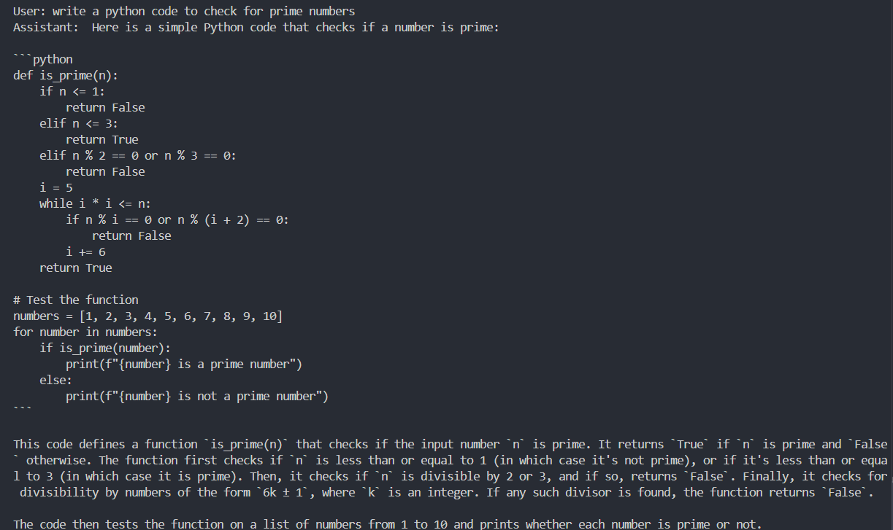

# LangGraph-Powered Python Code Assistant 🤖

[](https://langchain.com/langgraph)
[](https://opensource.org/licenses/MIT)

A stateful Python coding assistant that generates, explains, and evaluates code using LangGraph orchestration, RAG, and Ollama LLMs. Supports both CLI and Gradio web interface.

## Key Features ✨

- **Intent-Aware Routing**: LLM classifies requests as `generate_code` or `explain_code`
- **Multi-Interface Support**: 
  - CLI chat (`app.py`)
  - Gradio web UI (`webui.py`)
- **RAG Pipeline**: Retrieves similar code examples from MBPP dataset
- **Test-Driven Evaluation**: Validates generated code against test cases
- **Ollama Integration**: Runs locally with Mistral/Llama3 models

## Architecture 🏗️

```mermaid
graph TD
    A[User Input] --> B(Intent Classifier)
    B -->|generate_code| C[Code Generator]
    B -->|explain_code| D[Code Explainer]
    C --> E[Output]
    D --> E
    F[MBPP Dataset] -->|RAG| C
  ```
## Installation ⚙️

Clone the repo and install dependencies:

```bash
git clone https://github.com/nouran25/LangGraph-Powered-Python-Code-Assistant.git
cd LangGraph-Powered-Python-Code-Assistant
pip install -r requirements.txt
```
### Ollama Setup
  ```bash
  ollama pull mistral  # Default model
  ollama pull llama3   # Alternative for RAG
```
## Usage 🚀
### CLI Version
```bash
python app.py
```
Example:

```text
User: Write a function to reverse a string
Assistant: Here's the Python code:
```python
def reverse_string(s):
    return s[::-1]
```
 <!-- Replace with your actual demo GIF -->

### Web Interface
```bash
python webui.py
```
Access at http://localhost:7860

 <!-- Replace with your actual demo GIF -->
